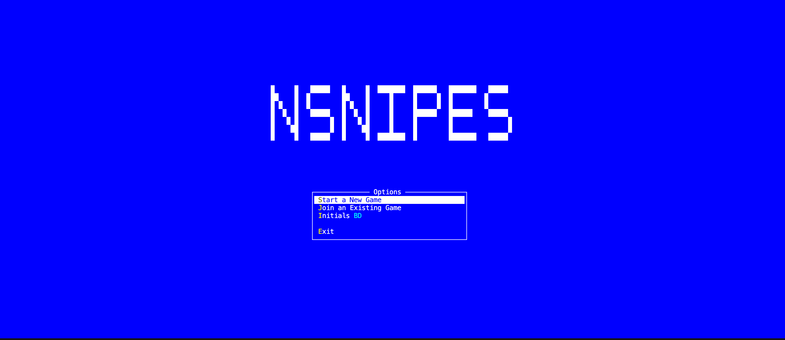
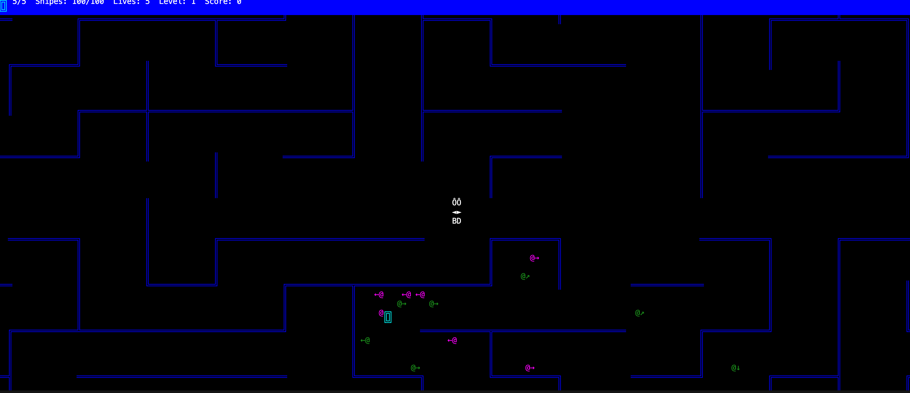

# nsnipes

> Snipes (diminutive for Snipers) is a text-mode networked computer game that was created in 1983 by SuperSet Software. Snipes is officially credited as being the original inspiration for NetWars.[1][2] It was one of the earliest text mode multi player games, running on Novell NetWare systems.


This is **My** 'interpretation' of the classic [Snipes](https://en.wikipedia.org/wiki/Snipes_(video_game)) game 

I first encountered this game on early versions of [Novell NetWare](https://en.wikipedia.org/wiki/NetWare).  A fantastic game that could be played across the network - alot of fun was had during 'lunchtimes', and I spent many an hour battling with colleagues across the network.  This project does not intend to be faithful to the original, the map will be different, the game play will be different (but similar);  but, what I hope to achieve with this is the ability to play this game with other players across the internet and bring back some of the nostalgia and FUN that the original had.
So this will be a 'stylised' version.  It's also 'my' version because I'm not trying to rip anyone off, or profit by copying.

This is an exercise in programming and networking as much as it is a journey into my distant memories.

## Building and Running

Use the provided `run.sh` script to build and run the game:
```bash
./run.sh
```


The 'Intro Screen' will change quite a bit as multi-player gaming is added


Game play, your player remains central - as you move the map moves around you and is endlessly scrolling. i.e. if you go off the top of the map you seemlessly rejoin the bottom - the map feels massive.  Hives release snipes,  and snipes will wander around the maze, but be careful, as soon as they get a sniff of you, they'll start to home in on you.

You can shoot snipes, you have bullets that can be shot in any direction and will bounce off walls too!   You can shoot hives, though it will take 3 shots to destroy a hive - hives are valuable to shoot, as you'll gain points for shooting the hive plus points for all of the un-released snipes within the hive -- shoot them quickly to gain more points!


## Preface
When I started this project, I was in between jobs and had alot of spare time.  Since then i've been fortunate enough to be very busy working.  The downside, is that this project over the last 10 months or so has seen no activity.  While I am very keen to get this project completed to my initial vision, time is still very valuable to me.   So I decided to accellerate the development of this by using 'Vibe Coding' - I really do hate that term, there is nothing 'vibby' about what i'm doing - I'm using an AI tool 'Cursor', giving it instructions and letting it build some code for me.  When it gets it wrong i'm re-iterating my intent and coercing it down a more correct path.

I chose this route so that I could get this project closer to completion, but also to extend my skills in working with tools like Cursor.

It's not perfect, I know that - some of the code committed, I'm far from being 100% happy with - but each prompt, each code commit is moving me closer to a working game and closer to my vision of having NSnipes run multi-player over the internet.   I do believe there will be an exercise of 'hand-refinement' on the code,  but i'm reserving that till i'm closer to the end.

It's been an interesting and sometimes frustrating journey so far working in this way, and while as I say above the code is far from being 100% perfect, the game has developed at a pace that I wasn't able to commit my own personal time to.

So what's left to do:
- Levels
  - Currently the game doesn't know when a level is complete (i.e. all Hives and Snipes are destroyed)
  - Incremental difficulty as Level's increase, i.e. more Snipes per hive,  more Hives
  - Ability to start the game at a given level (and for it to know based on level number how many hives/snipes to use)
- Multiplayer Enhancements
  - ✅ Start Multiplayer Game (implemented - prompts for player count, generates 6-character game ID, 60-second join window)
  - ✅ Join Multiplayer Game (implemented - prompts for game ID, waits for game to start)
  - ✅ Network game play (implemented - real-time synchronization of player positions, bullets, hives, snipes)
  - ⚠️ Full game state synchronization (scores, lives) - partially implemented, needs refinement
  - ❌ Multiplayer game end/results screen (after all players lose lives, show rankings and scores)
  - ❌ Option to restart another game with all the same players


## Gameplay Summary

### Intro Screen and Menu System

**Intro Screen**
- Animated NSNIPES banner that scrolls in from the left over 2 seconds
- Menu system with the following options:
  - **Start a New Game**: Begins a new single-player game with a clearing effect animation
  - **Start Multiplayer**: Host a new multiplayer game (1-5 players, 60-second join window)
  - **Join Multiplayer**: Join an existing multiplayer game by entering a 6-character game ID
  - **Initials**: Allows setting 2-character player initials (A-Z, 0-9)
  - **Exit**: Exits the application
- Menu navigation:
  - Arrow keys or numeric keypad (2/8) to navigate
  - ENTER to select
  - Keyboard shortcuts: S (Start), J (Join), I (Initials), E/X (Exit)
- Initials are saved to `nsnipes.json` and persist between game sessions
- Default initials are "AA" if not set

**Clearing Effects**
- Animated clearing effect when starting a new game or respawning
- Expanding rectangle of '*' characters reveals the map underneath
- Messages displayed during clearing:
  - "Level 1" when starting a new game
  - "X Lives Left" when player loses a life (but still has lives remaining)
  - "GAME OVER" when all lives are lost

**Game Over**
- When player loses all lives, "GAME OVER" message is displayed
- Game stops (no movement, bullets, snipes)
- Press any key to return to the intro screen
- Game state is fully reset when starting a new game after game over

### Current Features

**Player**
- Player starts with 5 lives
- Player is represented as a 2x3 character sprite showing:
  - Animated eyes (◄► / ◂▸) that blink
  - Player initials (customizable, 2 characters)
- Player can move in 8 directions (cardinal and diagonal)
- Smooth continuous movement while keys are held down
- Player respawns at a random valid position when hit by a snipe
- Game ends when all lives are lost

**Map**
- Forever-scrolling maze map that wraps around both horizontally and vertically
- Map fills the entire console window (no border)
- Collision detection prevents player from walking through walls
- Player position is tracked by top-left corner of the 2x3 sprite
- Map viewport is centered on the player

**Hives**
- Hives are small 2x2 rectangular boxes made of corner characters (╔ ╗ ╚ ╝)
- Hives glow between cyan and green colors, changing every 75ms
- Each hive has its own flash rate that decreases by 1/3 each time it's hit (minimum 10ms)
- At level 1, there are 5 hives randomly placed across the map
- Hive count increases by 1 every 5 levels
- Hives spawn snipes over time (each hive starts with 20 snipes: 10 type 'A', 10 type 'B')
- Hives are positioned randomly but never overlap walls or the player
- **Hives can be destroyed**: Hives require 3 direct bullet hits to be destroyed
- When destroyed, all unreleased snipes from that hive are killed, and the player gains 500 points plus 25 points per unreleased snipe
- Destroyed hives are properly removed from the screen

**Snipes**
- Two types of snipes: Type 'A' (magenta) and Type 'B' (green)
- Each snipe displays as '@' symbol followed by a direction arrow
- Snipes spawn randomly from hives over time (roughly every 3 seconds per hive)
- Snipes spawn in random directions from their hive
- Snipes move intelligently:
  - Maintain their current direction unless they hit a wall, collide with another snipe, or the player gets close
  - Use a "heat radius" system: closer to player = more attracted, further away = more random movement
  - Maximum heat radius is 20 cells - beyond this, snipes move randomly
  - When player is within heat radius, snipes are attracted toward the player
- Snipes cannot walk through walls
- When a snipe hits a wall, it randomly chooses a new direction
- Snipes bounce off each other when they collide (reverse direction)
- Snipes move every 200ms
- If a snipe touches the player, the snipe explodes and the player loses 1 life
- Both the '@' character and arrow are properly cleared when snipes move or are killed

**Bullets**
- Player can fire bullets in 8 directions using QWEASDZXC keys
- Maximum of 10 bullets active at any time
- Bullets move at 1 cell per 10ms update (fast movement)
- Bullets bounce off walls:
  - Horizontal walls reverse Y direction
  - Vertical walls reverse X direction
  - Corners use approach direction to determine bounce
- Bullets expire after 2 seconds
- Bullets are displayed as flashing red '*' characters (alternating bright red and red)
- Bullets fire from the appropriate player edge/corner based on direction
- **Bullets can kill snipes**: When a bullet hits a snipe (or snipe moves into bullet), both are removed and player gains 25 points
- **Bullets can damage hives**: When a bullet hits a hive, the bullet stops and is removed, and the hive takes 1 hit (3 hits to destroy)
- Bullets are properly cleared from the screen when they expire or hit targets

**Status Bar**
- Two rows at the top of the screen with dark blue background and white text
- Displays: Hives (remaining/total), Snipes (remaining/total), Lives, Level, and Score
- Status bar is updated periodically and shows current game state

**Game State**
- Tracks current level (starts at 1)
- Tracks player score (25 points per snipe killed, 500 points for hive + 25 per unreleased snipe)
- Tracks total and remaining hives
- Tracks total and remaining snipes
- Game state is fully reset when starting a new game

**Combat System**
- **Bullet-Snipe Collision**: When a bullet hits a snipe (or snipe moves into bullet), the snipe is killed, bullet is removed, and player gains 25 points
- **Bullet-Hive Collision**: When a bullet hits a hive, the bullet stops and is removed. Hives require 3 direct hits to be destroyed
- **Hive Destruction**: When a hive is destroyed (after 3 hits), all unreleased snipes from that hive are killed, and the player gains 500 points plus 25 points per unreleased snipe
- **Player-Snipe Collision**: When a snipe touches the player, the snipe explodes, player loses 1 life, and player respawns at a random position

## Controls

### Movement
- **Arrow Keys** or **Numeric Keypad (2, 4, 6, 8)**: Move in cardinal directions (up, down, left, right)
- **Numeric Keypad (1, 3, 7, 9)**: Move diagonally
  - 7: Up-Left
  - 8/↑: Up
  - 9: Up-Right
  - 4/←: Left
  - 6/→: Right
  - 1: Down-Left
  - 2/↓: Down
  - 3: Down-Right

### Shooting
- **Q**: Fire diagonally up-left
- **W**: Fire up
- **E**: Fire diagonally up-right
- **A**: Fire left
- **D**: Fire right
- **Z**: Fire diagonally down-left
- **X**: Fire down
- **C**: Fire diagonally down-right

### Menu Navigation (Intro Screen)
- **Arrow Keys** or **Numeric Keypad (2, 8)**: Navigate menu up/down
- **ENTER**: Select current menu option
- **S**: Quick select "Start a New Game"
- **M**: Quick select "Start Multiplayer"
- **J**: Quick select "Join Multiplayer"
- **I**: Quick select "Initials"
- **E** or **X**: Quick select "Exit"
- **ESC**: From intro screen exits application; from game returns to intro screen

### Initials Input
- When "Initials" option is selected, type 2 characters (A-Z, 0-9)
- Characters are automatically uppercased
- Input ends automatically after 2 characters are entered
- Initials are saved to `nsnipes.json` and persist between sessions
- **Backspace**: Delete last character
- **ESC**: Cancel input

## Recent Changes

### Multiplayer Implementation (Latest)
- **MQTT Networking**: Implemented full multiplayer support using MQTT protocol
- **Game Discovery**: Host can create games with 6-character game IDs, clients can join by ID
- **Real-time Synchronization**: Player positions, bullets, hives, and snipes synchronized across all clients
- **Host-Client Architecture**: Host is authoritative for game state (hives, snipes), all players can move and shoot
- **Player Rendering**: Remote players displayed in yellow, local player in white/blue
- **Position Synchronization**: Fixed initial position sync issues, proper world coordinate system
- **Respawn Synchronization**: Player respawn positions properly synchronized across network
- **Initials Synchronization**: Player initials correctly displayed for all players
- **Network Message System**: Comprehensive DTO system for all game events (positions, bullets, game state)

### Intro Screen and Menu System
- **Intro Screen**: Added animated NSNIPES banner that scrolls in from the left over 2 seconds
- **Menu System**: Implemented full menu with navigation, selection, and keyboard shortcuts
- **Multiplayer Menu Options**: Added "Start Multiplayer" and "Join Multiplayer" options
- **Waiting Screen**: Multiplayer waiting screen showing player count, game ID, and join notifications
- **Initials System**: Players can set and save their 2-character initials (persisted to nsnipes.json)
- **Clearing Effects**: Animated clearing effect when starting game or respawning, with messages
- **Game Over Screen**: Proper game over screen with key press to return to intro
- **Game Reset**: Full game state reset when starting a new game after game over
- **Code Refactoring**: Moved all intro screen code to separate `IntroScreen` class for better organization

### Player Movement Improvements
- **Continuous Movement**: Player movement now supports smooth continuous movement while keys are held
- **Key State Tracking**: Improved keyboard handling for more natural direction changes
- **Movement Responsiveness**: Player can change direction immediately when pressing new movement keys

### Combat and Scoring System
- **Bullet-Snipe Collision**: Implemented collision detection between bullets and snipes (both directions)
  - Bullets can hit snipes at their position or arrow position
  - Snipes can move into bullet positions
  - On collision: snipe is killed, bullet is removed, player gains 25 points
  - Both snipe '@' character and arrow are properly cleared when killed
- **Bullet-Hive Collision**: Implemented hive damage system
  - Bullets stop and are removed when hitting a hive
  - Hives track hit count (3 hits required to destroy)
  - Hive flash rate decreases by 1/3 each time it's hit (minimum 10ms)
  - When destroyed: hive is removed from screen, all unreleased snipes are killed, player gains 500 points + 25 per unreleased snipe
- **Scoring System**: Fully functional scoring with points awarded for:
  - Killing snipes: 25 points each
  - Destroying hives: 500 points base + 25 points per unreleased snipe
- **Status Bar Updates**: Displays Level and Score in addition to hives, snipes, and lives

### Visual and Performance Improvements
- **Refined Snipe Clearing Algorithm**: Implemented sophisticated position tracking system
  - Tracks all previous snipe positions (both '@' and arrow)
  - Only clears positions that are no longer occupied by any snipe
  - Prevents artifacts when multiple snipes move in close proximity
  - Handles cases where snipes don't move but direction changes
  - Previous positions are updated after drawing to ensure accuracy
- **Artifact Elimination**: Fixed remaining visual artifacts from snipe movement
  - Both '@' characters and arrows are now properly cleared
  - Works correctly even with many snipes spawning from hives
  - Handles edge cases like snipes colliding and bouncing back

### Core Game Systems
- **Hive System**: Implemented hives that spawn snipes, with visual representation (glowing cyan/green boxes)
- **Snipe System**: Implemented intelligent snipes with two types ('A' and 'B'), movement AI, and collision detection
- **Bullet System**: Implemented player shooting with 8-directional firing, wall bouncing, and lifetime management
- **Status Bar**: Two-row status display showing game statistics (hives, snipes, lives, level, score)

### Player Mechanics
- **Player Lives**: Player starts with 5 lives
- **Player Respawn**: Player respawns at random valid position when hit by a snipe
- **Collision Detection**: Improved player-wall collision to properly handle 2x3 player sprite
- **Player Initials**: Customizable 2-character initials displayed on player sprite

### Snipe AI and Behavior
- **Heat Radius System**: Snipes are attracted to player based on distance (closer = more attracted)
- **Direction Persistence**: Snipes maintain direction unless hitting walls, colliding with other snipes, or player gets close
- **Snipe-to-Snipe Collision**: Snipes bounce off each other when they collide
- **Random Spawning**: Snipes spawn from hives in random directions
- **Wall Avoidance**: Snipes randomly choose new direction when hitting walls
- **Snipe Display**: Uses '@' symbol (Type 'A' = magenta, Type 'B' = green)

### Visual Improvements
- **Full-Screen Display**: Removed border, map fills entire console
- **Snipe Colors**: Type 'A' = magenta, Type 'B' = green
- **Bullet Appearance**: Flashing red '*' characters
- **Hive Animation**: Smooth color transitions (cyan/green) every 75ms, with individual flash rates
- **Artifact Fixes**: Fixed '@' and arrow artifacts left behind by snipe movement
- **Clearing Effects**: Smooth animated transitions when starting game or respawning

### Performance Optimizations
- **Separate Timers**: Hives and snipes have their own update timers for better performance
- **Viewport Culling**: Only visible objects are drawn
- **Efficient Redrawing**: Sophisticated position tracking ensures only necessary positions are cleared
- **Smart Clearing**: Uses HashSet-based position tracking to avoid clearing positions still occupied by other snipes
- **Caching**: Map viewport and status bar values are cached to reduce redundant calculations

### Technical Improvements
- **Map Wrapping**: Proper handling of coordinate wrapping for all game entities
- **Collision Detection**: Comprehensive collision detection for player, bullets, snipes, and hives
- **Game State Management**: Centralized game state tracking with scoring
- **Code Organization**: Separated intro screen logic into `IntroScreen` class
- **Configuration Management**: Game configuration (initials) persisted to JSON file

## What Works

### Core Gameplay
✅ Player movement (8 directions with smooth continuous movement)  
✅ Wall collision detection (prevents player from walking through walls)  
✅ Bullet firing and movement (8 directions)  
✅ Bullet wall bouncing (horizontal/vertical wall detection)  
✅ Bullet-snipe collision (both directions)  
✅ Bullet-hive collision and damage (3 hits to destroy)  
✅ Player-snipe collision and life loss  
✅ Player respawn on death (random valid position)  
✅ Game over detection and screen  

### Game Entities
✅ Hive spawning and display (glowing cyan/green animation)  
✅ Hive destruction (3 hits required) - properly cleared from screen  
✅ Hive flash rate decreases when hit  
✅ Snipe spawning from hives (random directions)  
✅ Snipe movement and AI (heat radius attraction system)  
✅ Snipe-to-snipe collision and bouncing  
✅ Snipe wall collision and direction change  
✅ Clean visual rendering - no artifacts from snipe movement  

### UI and Menus
✅ Intro screen with animated banner  
✅ Menu system with navigation  
✅ Initials input and persistence (saved to nsnipes.json)  
✅ Clearing effect animations (game start, respawn, game over)  
✅ Status bar display (hives, snipes, lives, level, score)  
✅ Game over screen with key press to return to menu  
✅ Multiplayer waiting screen with player count and join notifications  

### Game Systems
✅ Map scrolling and wrapping (horizontal and vertical)  
✅ Game state tracking (level, score, counts)  
✅ Scoring system (25 points per snipe, 500 + 25 per unreleased snipe for hives)  
✅ Game reset functionality (fully resets when starting new game after game over)  
✅ Player initials customization  
✅ Configuration persistence (initials saved between sessions)  

### Technical Features
✅ Performance optimizations (separate timers, viewport culling, caching)  
✅ Efficient rendering (HashSet-based position tracking for snipes)  
✅ Smooth animations (player eyes, hive colors, clearing effects)  
✅ Code organization (IntroScreen class separated from Game class)  
✅ MQTT networking infrastructure (MqttGameClient, GameSession classes)  
✅ Network message serialization (JSON-based DTOs for all game events)  
✅ World coordinate system (all positions in map space, viewport conversion local)  

## Multiplayer Features

### ✅ Implemented

**Game Discovery and Joining**
- Host can start a multiplayer game (1-5 players)
- 6-character alphanumeric game ID for easy sharing
- 60-second join window for players to join
- Real-time player count updates ("X of Y players joined")
- Player join notifications ("[Initials] joined!")
- Game automatically starts after join window expires or max players reached

**Network Architecture**
- MQTT-based networking using HiveMQ public broker
- Host-client architecture (host is authoritative for game state)
- Real-time position synchronization (20ms update rate)
- Bullet synchronization across all players
- Game state synchronization (hives, snipes, player positions)

**Player Synchronization**
- All players see each other's movement in real-time
- Remote players displayed in yellow (local player in white/blue)
- Player initials synchronized across all clients
- Player respawn positions synchronized
- Player-to-player collision detection (players can't overlap)

**Game State Synchronization**
- Hive positions synchronized (all players see same hives)
- Snipe positions synchronized (host controls snipe movement, clients receive updates)
- Bullet positions synchronized (all players can shoot, host validates collisions)
- Game state snapshots on game start (ensures all players start with same state)

**Technical Implementation**
- World coordinate system (all positions in map space, converted to viewport locally)
- Proper viewport position tracking for artifact-free rendering
- Network latency handling (latest position updates, not every intermediate step)
- Sequence numbers for ordered position updates
- Fire-and-forget messaging for low-latency position updates

### ⚠️ Known Issues / Limitations

- Initial position synchronization may have minor timing issues
- Full game state synchronization (scores, lives) still being refined
- No level progression in multiplayer yet
- No game end/results screen for multiplayer yet

## Not Yet Implemented

❌ Level progression (automatic level advancement when all hives destroyed)  
❌ High score system  
❌ Multiplayer game end/results screen  
❌ Power-ups or special abilities  
❌ Different bullet types  
❌ Boss hives or special enemies  
❌ Sound effects  
❌ Pause functionality  

## Project Dependencies

This project is built with the following dependencies:
- https://github.com/gui-cs/Terminal.Gui (v2.0.0-prealpha.1895)
- MQTTnet (for multiplayer networking via MQTT)

## Map Generation

I used the following https://stackoverflow.com/questions/56918471/how-can-i-increase-corridor-width-in-a-maze Python code to generate the maze at an appropriate scale.  I captured the output produced by the following Python code, and used a Text editor to change lines, make the maze wrap around and break through some walls to simplify.

```
import random


def make_maze(w = 16, h = 8, scale=0):

    h0, h1, h2, h3 = "+--", "+  ", "|  ", "   "
    h0 += scale * '----'
    h1 += scale * '    '
    h2 += scale * '    '
    h3 += scale * '    '
    vis = [[0] * w + [1] for _ in range(h)] + [[1] * (w + 1)]
    ver = [[h2] * w + ['|'] for _ in range(h)] + [[]]
    hor = [[h0] * w + ['+'] for _ in range(h + 1)]

    def walk(x, y):
        vis[y][x] = 1

        d = [(x - 1, y), (x, y + 1), (x + 1, y), (x, y - 1)]
        random.shuffle(d)
        for (xx, yy) in d:
            if vis[yy][xx]: continue
            if xx == x: hor[max(y, yy)][x] = h1
            if yy == y: ver[y][max(x, xx)] = h3
            walk(xx, yy)

    walk(random.randrange(w), random.randrange(h))

    s = ""
    for (a, b) in zip(hor, ver):
        s += ''.join(a + ['\n'] + b + ['\n'])
        for _ in range(scale):
            s += ''.join(b + ['\n'])
    return s


print(make_maze(scale=0))
print('\n\n')
print(make_maze(scale=1))
print('\n\n')
print(make_maze(scale=2))
print('\n\n')
print(make_maze(scale=3))
print('\n\n')
```
Full Credit for this amazing scaleable Maze generator goes to https://stackoverflow.com/users/2875563/reblochon-masque

## Resources

So resources that I took a look at:
https://en.wikipedia.org/wiki/Snipes_(video_game)

https://www.youtube.com/watch?v=IXsJhoW0C78
https://www.youtube.com/watch?v=1iGKsuZlIIo
https://www.youtube.com/watch?v=85IcFHTsVQs

https://www.networkworld.com/article/830595/infrastructure-management-novell-and-the-computer-game-that-changed-networking.html

https://medium.com/venture-evolved/snipes-the-game-that-gave-birth-to-lans-e9dc169873e4

https://playclassic.games/games/arcade-dos-games-online/play-snipes-online/play/

https://www.giantbomb.com/snipes/3030-12025/

https://github.com/Davidebyzero/Snipes
