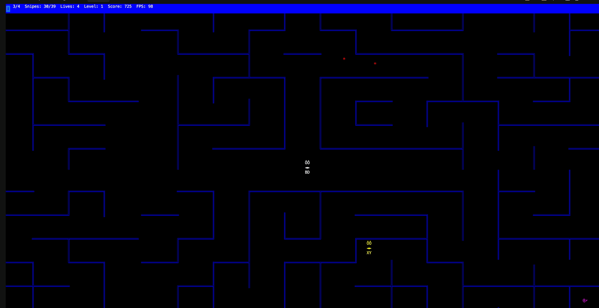

# nsnipes

> Snipes (diminutive for Snipers) is a text-mode networked computer game that was created in 1983 by SuperSet Software. Snipes is officially credited as being the original inspiration for NetWars.[1][2] It was one of the earliest text mode multi player games, running on Novell NetWare systems.


This is **My** 'interpretation' of the classic [Snipes](https://en.wikipedia.org/wiki/Snipes_(video_game)) game 

I first encountered this game on early versions of [Novell NetWare](https://en.wikipedia.org/wiki/NetWare).  A fantastic game that could be played across the network - alot of fun was had during 'lunchtimes', and I spent many an hour battling with colleagues across the network.  This project does not intend to be faithful to the original, the map will be different, the game play will be different (but similar);  but, what I hope to achieve with this is the ability to play this game with other players across the internet and bring back some of the nostalgia and FUN that the original had.
So this will be a 'stylised' version.  It's also 'my' version because I'm not trying to rip anyone off, or profit by copying.

This is an exercise in programming and networking as much as it is a journey into my distant memories.



## Building and Running

### Build

To build the full solution, run:

**Linux/macOS (Bash):**
```bash
./build.sh
```

**Windows (PowerShell):**
```powershell
.\build.ps1
```

Do this after pulling changes or when you want a clean build. For multi-terminal multiplayer (e.g. several clients), build once then run multiple clients or servers as needed.

### Starting the gRPC Server

The multiplayer game requires a gRPC server to be running. Start it first:

**Linux/macOS (Bash):**
```bash
./run-server.sh
```

**Windows (PowerShell):**
```powershell
.\run-server.ps1
```

To use a different port, set the `PORT` environment variable (e.g. `PORT=5001 ./run-server.sh`).

The server will start on `http://0.0.0.0:5000` by default (listening on all network interfaces). **Note**: While the server binds to `0.0.0.0`, clients should connect to `http://127.0.0.1:5000` or `http://localhost:5000` (not `0.0.0.0`). The default client configuration uses `127.0.0.1:5000`. You can configure the server address and port in the client via the "Configure Server" menu option.

### Starting the Game Client

Use the provided scripts to run the game:

**Linux/macOS (Bash):**
```bash
./run.sh
```

**Windows (PowerShell):**
```powershell
.\run.ps1
```

Build the solution first with `./build.sh` or `.\build.ps1` when needed (e.g. after pulling changes or when running multiple clients).

## Starting a Game

### Single Player Game

1. Start the game client (see "Starting the Game Client" above)
2. From the intro screen menu, select **"Start a New Game"** (or press **S**)
3. You'll be prompted to **"Select Starting Level"** (default: 1, limit: 50)
   - Type a number (1-50) or press ENTER to use the default (1)
4. The game will start immediately with a clearing effect animation showing the level information
5. You can play solo - no network connection required for single player mode

### Multiplayer Game

**Prerequisites:**
- The gRPC server must be running (see "Starting the gRPC Server" above)
- All players must be able to connect to the same server (default: `127.0.0.1:5000` or `localhost:5000`)

**To Host a Multiplayer Game:**

1. Start the gRPC server (if not already running)
2. Start the game client
3. From the intro screen menu, select **"Start Multiplayer"** (or press **M**)
4. You'll be prompted to **"Select Starting Level"** (default: 1, limit: 50)
   - Type a number (1-50) or press ENTER to use the default (1)
5. You'll be prompted for **"How many players?"** (1-5)
   - Type a number (1-5) or press ENTER to use the default (2)
   - **Note**: If you select 1 player, the game will start immediately in single-player mode (no network)
6. If you selected 2-5 players, you'll see a waiting screen with:
   - Your **6-character Game ID** (e.g., "ABC123")
   - Current player count (e.g., "1 of 3 players joined")
   - Join notifications as players join
7. Share the Game ID with other players
8. The game will automatically start when:
   - The maximum number of players join, OR
   - 60 seconds elapse (whichever comes first)

**To Join a Multiplayer Game:**

1. Ensure the gRPC server is running (same server as the host)
2. Start the game client
3. From the intro screen menu, select **"Join Multiplayer"** (or press **J**)
4. Enter the **6-character Game ID** provided by the host
5. You'll see a waiting screen showing:
   - Current player count
   - Join notifications as other players join
6. Wait for the game to start (when max players join or 60 seconds elapse)
7. The game will begin with all players synchronized

**Multiplayer Tips:**
- All players should use the same starting level for consistency
- The **server** (not the host) is the game authority: it runs the simulation and broadcasts state; all clients send only input (move/fire) and render the state they receive
- All players can move and shoot independently; bullets, snipes, hives, level, and scores are synchronized in real-time from the server
- **Player-vs-player (PvP)**: In multiplayer, players can shoot each other. If your bullet hits another player, they die, lose a life, and respawn at a random position if they have lives left; you gain **1000 points** for the kill. All of the shot player's bullets vanish when they die.
- When all players leave (gracefully or by disconnect), the server abandons the game and frees the room
- If the host disconnects, the game may become unstable (host migration not yet implemented)


The 'Intro Screen' will change quite a bit as multi-player gaming is added


Game play, your player remains central - as you move the map moves around you and is endlessly scrolling. i.e. if you go off the top of the map you seemlessly rejoin the bottom - the map feels massive.  Hives release snipes,  and snipes will wander around the maze, but be careful, as soon as they get a sniff of you, they'll start to home in on you.

You can shoot snipes, you have bullets that can be shot in any direction and will bounce off walls too!   You can shoot hives, though it will take 3 shots to destroy a hive - hives are valuable to shoot, as you'll gain points for shooting the hive plus points for all of the un-released snipes within the hive -- shoot them quickly to gain more points! In **multiplayer**, you can also shoot other players: the shot player dies, loses a life, and respawns if they have lives left; you gain 1000 points per kill, and all of that player's bullets vanish.

## Architecture & industry context

### Target architecture (multiplayer)

Multiplayer uses a **server-authoritative** model over **gRPC** with bidirectional streaming:

```
┌─────────┐         ┌──────────────┐         ┌─────────┐
│ Player1 │◄───────►│ gRPC Server  │◄───────►│ Player2 │
│ (Client)│         │ (Authority)  │         │ (Client)│
└─────────┘         └──────────────┘         └─────────┘
```

- **Server** (`NSnipes.GrpcServer`): Runs the game simulation (`NSnipes.Core.GameSimulation`) in a tick loop. Receives **input only** (move/fire) from each client, applies it, ticks the sim, and broadcasts a **game state snapshot** (players, hives, snipes, bullets, level, scores, lives) to all clients at ~20 Hz.
- **Clients** (`NSnipes`): Send **input only** (direction and fire); do not run the sim in multiplayer. They render the state received from the server (map, entities, bullets). Joining players see "Syncing game state..." until the first snapshot arrives so the map and collision stay correct.
- **Shared core** (`NSnipes.Core`): Map, GameState, Player, Hive, Snipe, Bullet, and `GameSimulation` live in a single library so the server and (for future refactor) single-player can use the same logic.

This gives a single source of truth on the server, consistent bullets/snipes/level for everyone, and a clean split between input (client) and simulation (server).

### Why server-authoritative?

- **Single source of truth**: One simulation avoids desyncs between host and clients.
- **Sync**: Bullets, snipes, hives, level progression, and scores are identical for all players because they all come from the server.
- **Cheat resistance**: Clients cannot dictate outcomes; they only send input.

### Why gRPC?

From the [multiplayer networking analysis](MULTIPLAYER_NETWORKING_ANALYSIS.md): gRPC was chosen over MQTT and WebSockets for server-based multiplayer because it offers **lower latency** (HTTP/2 + binary protobuf, ~25–70 ms), **type-safe** generated code, **native .NET** support (ASP.NET Core), and the **same user experience** (join by game ID, no IP addresses). Protocol Buffers keep messages compact and efficient for real-time state updates.

### Single-player

Single-player runs the game loop **locally** in the client (no server). An optional future refactor could run `GameSimulation` from `NSnipes.Core` locally for single-player too, so one code path drives both local and networked play.

## Preface
When I started this project, I was in between jobs and had alot of spare time.  Since then i've been fortunate enough to be very busy working.  The downside, is that this project over the last 10 months or so has seen no activity.  While I am very keen to get this project completed to my initial vision, time is still very valuable to me.   So I decided to accellerate the development of this by using 'Vibe Coding' - I really do hate that term, there is nothing 'vibby' about what i'm doing - I'm using an AI tool 'Cursor', giving it instructions and letting it build some code for me.  When it gets it wrong i'm re-iterating my intent and coercing it down a more correct path.

I chose this route so that I could get this project closer to completion, but also to extend my skills in working with tools like Cursor.

It's not perfect, I know that - some of the code committed, I'm far from being 100% happy with - but each prompt, each code commit is moving me closer to a working game and closer to my vision of having NSnipes run multi-player over the internet.   I do believe there will be an exercise of 'hand-refinement' on the code,  but i'm reserving that till i'm closer to the end.

It's been an interesting and sometimes frustrating journey so far working in this way, and while as I say above the code is far from being 100% perfect, the game has developed at a pace that I wasn't able to commit my own personal time to.

So what's left to do:
- Multiplayer (server-authoritative)
  - ✅ Start Multiplayer Game (prompts for player count, 6-character game ID, 60-second join window)
  - ✅ Join Multiplayer Game (prompts for game ID, waits for game to start)
  - ✅ Server-authoritative simulation (server runs `NSnipes.Core.GameSimulation`; clients send input only, receive state snapshots)
  - ✅ Bullet, snipe, hive, level, and score synchronization (from server state)
  - ✅ Player-vs-player (PvP): players can shoot each other; shot player dies, loses a life, respawns if lives left; shooter gets 1000 points; dead player's bullets vanish
  - ✅ Player visibility and hive synchronization; joining player map fix (wait for first snapshot)
  - ✅ Multiplayer game end/results screen; server abandons game when all players leave
  - ✅ Server configuration UI (configure server address/port, status display)
  - ❌ Option to restart another game with all the same players
  - ⚠️ Extensive testing for multiplayer stability and wider network/internet
- Single-player
  - ✅ Single-player game play is complete (local game loop, no server)
  - ⚠️ Optional: refactor single-player to use `NSnipes.Core.GameSimulation` locally (same logic as server)
- Technical
  - ✅ Terminal.Gui v2, .NET 10, zero warnings
  - ⚠️ Fix global [ESC] key handling across all screens

## TO-DO

**Note**: Single-player is complete; multiplayer is server-authoritative and feature-complete for core play.

- Optional: use `GameSimulation` from `NSnipes.Core` for single-player too (one code path for local and server).
- More playtesting for level-ups, game over, and multiplayer across wider network/internet.


## Gameplay Summary

### Intro Screen and Menu System

**Intro Screen**
- Animated NSNIPES banner that scrolls in from the left over 2 seconds
- **Interactive Demo Animation**: After the banner centers (2 seconds), an interactive demo begins showing gameplay mechanics:
  - Two demo players (BD in white, NP in yellow) move around the screen with intelligent AI
  - Players avoid the menu and logo areas, maintain direction for smoother movement, and can shoot at snipes
  - Snipes (TypeA in magenta, TypeB in green) spawn from menu edges and move away from players
  - Players shoot red '*' bullets toward nearest snipes with collision detection
  - Demo entities respawn when hit, creating continuous gameplay demonstration
  - Menu remains fully accessible and functional during the demo
  - Demo automatically pauses when any menu option is selected and resumes when returning to the main menu
- Menu system with the following options:
  - **Start a New Game**: Begins a new single-player game with a clearing effect animation
  - **Start Multiplayer**: Host a new multiplayer game (1-5 players, 60-second join window)
  - **Join Multiplayer**: Join an existing multiplayer game by entering a 6-character game ID
  - **Initials**: Allows setting 2-character player initials (A-Z, 0-9)
  - **Configure Server**: Configure gRPC server address and port (saved to nsnipes.json)
  - **Exit**: Exits the application
- Menu navigation:
  - Arrow keys or numeric keypad (2/8) to navigate
  - ENTER to select
  - Keyboard shortcuts: S (Start), J (Join), I (Initials), C (Configure Server), E/X (Exit)
- Menu highlighting: First letter of each menu item highlighted in Cyan (was Yellow)
- Initials are saved to `nsnipes.json` and persist between game sessions
- Default initials are "AA" if not set

**Clearing Effects**
- Animated clearing effect when starting a new game, respawning, or starting a new level
- Expanding rectangle of '*' characters reveals the map underneath
- Messages displayed during clearing:
  - "LEVEL n - x HIVES with y SNIPES" when starting a new level
  - "X Lives Left" when player loses a life (but still has lives remaining)

**Game Over Screen**
- When all players lose all lives, animated "GAME OVER" banner scrolls in from the left
- Banner displays "GAME OVER" with space between words (white block text on blue background)
- Shows "-< SCORES >-" header followed by player scores sorted by score (descending)
- Top player displayed in cyan, all other players in yellow
- Game stops (no movement, bullets, snipes)
- Press ENTER to return to the intro screen
- Game state is fully reset when starting a new game after game over

### Current Features

**Player**
- Player starts with 5 lives
- Player is represented as a 2x3 character sprite showing:
  - Animated eyes (◄► / ◂▸) that blink
  - Player initials (customizable, 2 characters)
- Player can move in 8 directions (cardinal and diagonal)
- Smooth continuous movement while keys are held down
- Player respawns at a random valid position when hit by a snipe
- Player position resets to random location at the start of each new level
- Game ends when all players lose all lives (multiplayer) or player loses all lives (single player)

**Map**
- Forever-scrolling maze map that wraps around both horizontally and vertically
- Map fills the entire console window (no border)
- Collision detection prevents player from walking through walls
- Player position is tracked by top-left corner of the 2x3 sprite
- Map viewport is centered on the player

**Hives**
- Hives are small 2x2 rectangular boxes made of corner characters (╔ ╗ ╚ ╝)
- Hives glow between cyan and green colors, changing every 75ms
- Each hive has its own flash rate that decreases by 1/3 each time it's hit (minimum 10ms)
- **Level-based configuration**:
  - Level 1: 4 hives, each with 10 snipes
  - Each level: +1 snipe per hive
  - Every 4 levels: +1 hive
  - Example: Level 1 = 4 hives × 10 snipes, Level 2 = 4 hives × 11 snipes, Level 5 = 5 hives × 14 snipes
- Hives spawn snipes over time (snipes split evenly between type 'A' and type 'B')
- Hives are positioned randomly but never overlap walls or the player
- **Hives can be destroyed**: Hives require 3 direct bullet hits to be destroyed
- When destroyed, all unreleased snipes from that hive are killed, and the player gains 500 points plus 25 points per unreleased snipe
- Destroyed hives are properly removed from the screen

**Snipes**
- Two types of snipes: Type 'A' (magenta) and Type 'B' (green)
- Each snipe displays as '@' symbol followed by a direction arrow
- Snipes spawn randomly from hives over time (roughly every 3 seconds per hive)
- Snipes spawn in random directions from their hive
- Snipes move intelligently:
  - Maintain their current direction unless they hit a wall, collide with another snipe, or the player gets close
  - Use a "heat radius" system: closer to player = more attracted, further away = more random movement
  - Maximum heat radius is 20 cells - beyond this, snipes move randomly
  - When player is within heat radius, snipes are attracted toward the player
- Snipes cannot walk through walls
- When a snipe hits a wall, it randomly chooses a new direction
- Snipes bounce off each other when they collide (reverse direction)
- Snipes move every 200ms
- If a snipe touches the player, the snipe explodes and the player loses 1 life
- Both the '@' character and arrow are properly cleared when snipes move or are killed

**Bullets**
- Player can fire bullets in 8 directions using QWEASDZXC keys
- Maximum of 10 bullets active at any time
- Bullets move at 1 cell per 10ms update (fast movement)
- Bullets bounce off walls:
  - Horizontal walls reverse Y direction
  - Vertical walls reverse X direction
  - Corners use approach direction to determine bounce
- Bullets expire after 2 seconds
- Bullets are displayed as flashing red '*' characters (alternating bright red and red)
- Bullets fire from the appropriate player edge/corner based on direction
- **Bullets can kill snipes**: When a bullet hits a snipe (or snipe moves into bullet), both are removed and player gains 25 points
- **Bullets can damage hives**: When a bullet hits a hive, the bullet stops and is removed, and the hive takes 1 hit (3 hits to destroy)
- Bullets are properly cleared from the screen when they expire or hit targets

**Status Bar**
- Two rows at the top of the screen with dark blue background and white text
- Displays: Hives (remaining/total), Snipes (remaining/total), Lives, Level, and Score
- Status bar is updated periodically and shows current game state

**Game State**
- Tracks current level (starts at 1)
- Tracks player score (25 points per snipe killed, 500 points for hive + 25 per unreleased snipe; 1000 points per player kill in multiplayer PvP)
- Tracks total and remaining hives
- Tracks total and remaining snipes
- Game state is fully reset when starting a new game

**Combat System**
- **Bullet-Snipe Collision**: When a bullet hits a snipe (or snipe moves into bullet), the snipe is killed, bullet is removed, and player gains 25 points
- **Bullet-Hive Collision**: When a bullet hits a hive, the bullet stops and is removed. Hives require 3 direct hits to be destroyed
- **Hive Destruction**: When a hive is destroyed (after 3 hits), all unreleased snipes from that hive are killed, and the player gains 500 points plus 25 points per unreleased snipe
- **Player-Snipe Collision**: When a snipe touches the player, the snipe explodes, player loses 1 life, and player respawns at a random position
- **Bullet-Player (PvP, multiplayer only)**: When a bullet hits another player, that player dies, loses 1 life, and respawns at a random position if they have lives left. The shooter gains **1000 points**. All bullets owned by the shot player are removed instantly.

## Controls

### Movement
- **Arrow Keys** or **Numeric Keypad (2, 4, 6, 8)**: Move in cardinal directions (up, down, left, right)
- **Numeric Keypad (1, 3, 7, 9)**: Move diagonally
  - 7: Up-Left
  - 8/↑: Up
  - 9: Up-Right
  - 4/←: Left
  - 6/→: Right
  - 1: Down-Left
  - 2/↓: Down
  - 3: Down-Right

### Shooting
- **Q**: Fire diagonally up-left
- **W**: Fire up
- **E**: Fire diagonally up-right
- **A**: Fire left
- **D**: Fire right
- **Z**: Fire diagonally down-left
- **X**: Fire down
- **C**: Fire diagonally down-right

### Menu Navigation (Intro Screen)
- **Arrow Keys** or **Numeric Keypad (2, 8)**: Navigate menu up/down
- **ENTER**: Select current menu option
  - **S**: Quick select "Start a New Game"
  - **M**: Quick select "Start Multiplayer"
  - **J**: Quick select "Join Multiplayer"
  - **I**: Quick select "Initials"
  - **C**: Quick select "Configure Server"
  - **E** or **X**: Quick select "Exit"
- **ESC**: From intro screen exits application; from game returns to intro screen

### Initials Input
- When "Initials" option is selected, type 2 characters (A-Z, 0-9)
- Characters are automatically uppercased
- Input ends automatically after 2 characters are entered
- Initials are saved to `nsnipes.json` and persist between sessions
- **Backspace**: Delete last character
- **ESC**: Cancel input

## Recent Changes

### Server-authoritative multiplayer & stability (Latest)
- **Server-authoritative architecture**: Game logic lives in `NSnipes.Core` (Map, GameState, Player, Hive, Snipe, Bullet, `GameSimulation`). The gRPC server runs the simulation in a tick loop; clients send **input only** (move/fire) and render **state only** (snapshots from the server). Bullets, snipes, hives, level, and scores are fully synchronized from the server.
- **Player-vs-player (PvP)**: In multiplayer, players can shoot each other. When a bullet hits another player (server-authoritative): the shot player dies, loses a life, and respawns at a random position if they have lives left; the shooter is awarded **1000 points**; all bullets owned by the shot player are removed instantly.
- **Joining player map fix**: The joining client no longer draws the map until it has received at least one game state snapshot with its position, avoiding a broken/misaligned map and invisible walls. A "Syncing game state..." message is shown until then. The draw path also uses a single captured viewport per frame to avoid torn reads when snapshots update position mid-draw.
- **Collection-modified crash fix**: Multiplayer could crash with "Collection was modified; enumeration operation may not execute" when the network thread updated hives/snipes/bullets/players while the UI thread was drawing them. All such updates are now under a lock, and all draw/iteration code takes a snapshot of the collection under that lock and iterates the snapshot.
- **Server cleanup when all players leave**: When every player disconnects (gracefully or not), the server stops the game simulation and removes the room, freeing resources and avoiding errors from writing to closed streams.
- **Server logging**: Console logging on the gRPC server now includes date and time (e.g. `yyyy-MM-dd HH:mm:ss`).

### gRPC Server Address Configuration
- **Server Address Default**: Changed default client server address from `localhost` to `127.0.0.1` for clarity
- **Server Binding**: Server correctly binds to `0.0.0.0:5000` (listening on all network interfaces) - this is correct for server operation
- **Client Connection**: Clients should connect to `127.0.0.1:5000` or `localhost:5000` (not `0.0.0.0:5000`)
- **Server Logging**: Server log messages now clarify that clients should connect to `127.0.0.1:5000` or `localhost:5000`
- **Default Configuration**: Both `GameConfig` and `GrpcGameClient` now default to `127.0.0.1:5000`

### Input Screen Improvements (Latest)
- **Starting Level Input Screen**: Improved user experience for level selection
  - Changed all backgrounds from blue to black (matches main game aesthetic)
  - Cursor positioned over the default '1' digit for easy overtyping
  - Pressing ENTER accepts the default value (1) if input is empty
  - Cursor automatically hidden when moving to next screen
- **Player Count Input Screen**: Improved user experience for player count selection
  - Changed all backgrounds from blue to black (matches main game aesthetic)
  - Cursor positioned over the default '1' digit for easy overtyping
  - Pressing ENTER accepts the default value (1) if input is empty
  - Cursor automatically hidden when moving on from this screen
- **Visual Consistency**: Both input screens now use black backgrounds throughout (prompt, input, instructions) for consistency with the main game

### Intro Screen Demo Animation (Latest)
- **Interactive Demo Animation**: Added fully functional demo animation to the intro screen
  - Two demo players (BD white, NP yellow) with intelligent movement AI
  - Players maintain direction for 3-8 moves before changing, creating smoother movement patterns
  - Players avoid menu/logo areas, avoid each other, and home in on nearby snipes
  - Players can occasionally pause (15% chance) for more realistic behavior
  - Snipes spawn from menu edges (mix of TypeA magenta and TypeB green)
  - Snipes move with direction persistence (5-12 moves before changing direction)
  - Snipes reverse direction when reaching screen edges
  - **Snipe Rendering**: Snipes display correctly with arrow to the side (not underneath), matching game format
    - Moving left: arrow first, then '@' character
    - Moving right or other: '@' character first, then arrow
  - Players shoot red '*' bullets toward nearest snipes
  - **Bullet Behavior**: Bullets bounce off screen edges (matching game's wall bouncing behavior)
  - **Bullet Speed**: Reduced to 8.0 per update for better visibility in demo
  - **Burst Fire**: Players occasionally fire bursts of 3 bullets in quick succession (15% chance, 100ms between bullets)
  - **Shooting Frequency**: Reduced to 1200ms between shots for more realistic demo pacing
  - Bullet-snipe and bullet-player collision detection with respawn logic
  - Bullets are removed when hitting menu or logo areas
  - Demo pauses automatically when menu options are selected
  - Menu remains fully accessible and visible at all times
  - Performance optimized with parallel processing, caching, and squared distance calculations
  - Uses C# 14 features: primary constructors, collection expressions, `in` parameters, `ReadOnlySpan`

### Terminal.Gui v2 Upgrade and .NET 10 Migration
- **Upgraded to Terminal.Gui v2.0.0-develop.4828**: Complete migration from v2.0.0-prealpha.1895 to the latest develop branch
  - Refactored to use `IApplication` pattern with `Application.Create()`, `app.Init()`, and `app.Run()`
  - Converted all `Application.Driver` calls to `View`'s rendering methods (`OnDrawingContent`, `Move`, `SetAttribute`, `AddRune`)
  - Updated keyboard handling from `Application.KeyDown` to `IApplication.Keyboard.KeyDown` with the new `Key` class
  - Replaced `Application.AddTimeout` with `IApplication.TimedEvents.Add` for all game timers
  - Converted `IntroScreen` and `GameOverScreen` to proper `View` subclasses with `OnDrawingContent` rendering
  - Fixed visibility management for view hierarchy (child views only render when parent is visible)
  - Added ANSI escape sequences for cursor visibility control
  - Created `ViewHelpers` extension methods for common drawing operations
- **Upgraded to .NET 10**: Both NSnipes game client and NSnipes.GrpcServer now target .NET 10
- **Zero Compilation Warnings**: All deprecated API usage eliminated, clean build with no warnings
- **Performance Optimizations**: Optimized redraw triggers to only update when game state changes (improved from 3 FPS to 30-60 FPS)
- **Input System Fixes**: 
  - Fixed cursor keys properly moving player instead of firing bullets
  - Fixed text input (initials, level selection, server config) working with Terminal.Gui v2 `Key` API
  - Separated movement and firing key handling to prevent conflicts
- **Game State Fixes**:
  - Fixed Game Over screen not displaying when player loses all lives
  - Fixed respawn animation and "X LIVES LEFT" banner display
  - Fixed status bar flickering by removing stale caching optimizations

### Multiplayer Synchronization Fixes
- **Player Visibility Fix**: Fixed issue where Player 2 couldn't see Player 1
  - Problem: Position updates were received but network players weren't being created if player wasn't in game session
  - Solution: Network players are now created from position updates even if not yet in game session (with default values)
  - Players are automatically added to game session for consistency
- **Hive Synchronization**: Fixed issue where hives weren't visible to joining players
  - Host now sends complete game state snapshot when players join (includes hives, snipes, and all player positions)
  - Game state snapshot sent both when game starts and when players join mid-game
  - Clients properly process and display all hives from the snapshot
- **Game State Snapshot Improvements**:
  - Host includes all players in snapshot (from game session, not just network players)
  - Ensures newly joined players receive complete game state
  - Snapshot includes hives, snipes, and all player positions with world coordinates
- **Position Update Reliability**:
  - Periodic position updates (every 200ms) ensure players are visible even when stationary
  - Position updates create network players if they don't exist yet
  - Improved handling of position updates arriving before game state snapshot

### Server Configuration UI (Latest)
- **Server Configuration Menu**: Added "Configure Server" option to intro screen menu
  - Allows players to set custom gRPC server address and port
  - Configuration saved to `nsnipes.json` and persists between sessions
  - Defaults to `127.0.0.1:5000` if not configured
- **Server Status Display**: Real-time server connectivity status on intro screen
  - Green indicator when server is online and reachable
  - Red indicator when server is offline or unreachable
  - Status checked periodically using lightweight gRPC connectivity test
  - Positioned at bottom of screen (one row up from absolute bottom)

### Bug Fixes (Latest)
- **Bullet Removal**: Fixed visual artifacts where bullets weren't removed from screen after hitting targets
  - Bullets now properly cleared when hitting players, snipes, or hives
  - Bullets cleared when expired or hit on remote clients
- **Window Resize Handling**: Fixed map not redrawing when terminal window is resized
  - Map now redraws immediately when window dimensions change
  - Proper clearing and redrawing of entire game area on resize
  - Cached map viewport invalidated on resize
- **Multiplayer Game Start Flow**: Fixed intro screen being redisplayed instead of waiting for players
  - Host now immediately shows waiting screen with "Connecting..." game ID
  - Game ID updates to actual ID once received from server
  - Proper waiting screen display with player count and join notifications
- **Menu Display Fixes**:
  - Fixed missing "Exit" option in menu (incorrect menu item count calculation)
  - Fixed screen jump when first navigating menu
  - Moved server status message up by one row for better visibility
- **Intro Screen Animation**: Fixed menu not appearing after player character exits intro screen
  - Player character now properly leads banner across screen and exits
  - Menu appears correctly after animation completes
  - Proper timing and positioning for smooth animation

### gRPC Multiplayer Implementation
- **Replaced MQTT with gRPC**: Complete migration from MQTT to gRPC for multiplayer networking
  - **Why gRPC?**: Lower latency, better performance, type-safe protocol buffers, built-in .NET support
  - **Server Architecture**: Dedicated gRPC server (`NSnipes.GrpcServer`) manages game rooms and message routing
  - **Client Architecture**: `GrpcGameClient` replaces `MqttGameClient` with bidirectional streaming
  - **Protocol Buffers**: All game messages defined in `game.proto` for efficient binary serialization
- **Server Scripts**: Added `run-server.sh` and `run-server.ps1` for easy server startup
  - Default server address: `http://127.0.0.1:5000` (clients connect to `127.0.0.1:5000`, server binds to `0.0.0.0:5000`)
  - Run scripts only run (no build option); use `build.sh` / `build.ps1` to build the full solution
- **Improved Latency**: gRPC's binary protocol and HTTP/2 provide significantly lower latency than MQTT
- **Type Safety**: Protocol buffers provide compile-time type checking for all game messages
- **Better Error Handling**: Structured error responses and connection management
- **Bidirectional Streaming**: Real-time game messages flow through a single persistent connection
- **Game Room Management**: Server manages game rooms, player connections, and message routing
- **Backward Compatibility**: Single-player mode unchanged (no network required)

### Build and Run Scripts
- **Build scripts**: `build.sh` (Linux/macOS) and `build.ps1` (Windows) build the complete solution (`NSnipes.sln`)
- **Run scripts**: `run.sh` / `run.ps1` run the game client only; `run-server.sh` / `run-server.ps1` run the gRPC server only (no build option)
- Workflow: run the build script when needed (e.g. after pulling changes or before multi-terminal testing), then use run/run-server as needed

### Bug Fixes (Latest)
- **Snipe Count Display Fix**: Fixed incorrect snipe count display (was showing 80/40 instead of 40/40)
  - Issue: `SnipesUndestroyed` was being incremented when snipes spawned, causing double counting
  - Fix: `SnipesUndestroyed` now correctly represents all snipes (in hives + spawned), only decreases when snipes are killed or hives are destroyed
  - Status bar now correctly shows "40/40" at start of Level 1 (40 snipes undestroyed out of 40 total)

### Level System Implementation
- **Level Progression**: Implemented complete level system with automatic progression
  - Level 1 starts with 4 hives, each with 10 snipes
  - Each level increases snipes per hive by 1
  - Every 4 levels adds 1 additional hive
  - Level completion when all hives and all snipes are destroyed
- **Level Start Screen**: Animated clearing screen shows "LEVEL n - x HIVES with y SNIPES" at start of each level
- **Player Respawn**: All players reset to random positions at the start of each new level
- **Level State Management**: Proper level tracking and progression in both single-player and multiplayer modes

### Game Over Screen (Latest)
- **Animated Banner**: "GAME OVER" banner animates in from the left (white block text on blue background)
- **Banner Spacing**: Space between "GAME" and "OVER" words for better readability
- **Player Scores Display**: Shows all players sorted by score (descending) with "-< SCORES >-" header
- **Visual Hierarchy**: Top player displayed in cyan, all other players in yellow
- **Key Handling**: ENTER key returns to intro screen (other keys ignored)
- **Code Organization**: Moved game over screen to separate `GameOverScreen` class for better separation of concerns
- **Multiplayer Support**: Game over triggers when ALL players lose all lives, showing all player scores

### Multiplayer Implementation
- **gRPC Networking**: Full multiplayer support using gRPC (replaced MQTT)
  - **Server**: Dedicated gRPC server runs the game simulation (`NSnipes.Core.GameSimulation`) and manages rooms and message routing
  - **Client**: `GrpcGameClient` handles connection, game creation/joining, and bidirectional streaming; clients send **input only** (move/fire), receive **state snapshots**
  - **Protocol Buffers**: All game messages in `game.proto` (e.g. `PlayerInput`, `GameStateSnapshot` with players, hives, snipes, bullets, level, scores)
  - **Bidirectional Streaming**: Real-time input and state over persistent HTTP/2 connections
- **Server-authoritative**: Server is the single source of truth; bullets, snipes, hives, level, and scores are synchronized from server state
- **Game Discovery**: Host creates games with 6-character game IDs; clients join by ID; game starts when full or 60s elapse
- **Player Rendering**: Remote players in yellow, local player in white/blue; joining player sees "Syncing game state..." until first snapshot
- **Single Player Mode**: When starting multiplayer with 1 player, game starts immediately without network (local play only)

### Intro Screen and Menu System
- **Intro Screen**: Added animated NSNIPES banner that scrolls in from the left over 2 seconds
- **Menu System**: Implemented full menu with navigation, selection, and keyboard shortcuts
- **Multiplayer Menu Options**: Added "Start Multiplayer" and "Join Multiplayer" options
- **Waiting Screen**: Multiplayer waiting screen showing player count, game ID, and join notifications
- **Initials System**: Players can set and save their 2-character initials (persisted to nsnipes.json)
- **Clearing Effects**: Animated clearing effect when starting game, respawning, or starting new level, with messages
- **Game Reset**: Full game state reset when starting a new game after game over
- **Code Refactoring**: Moved all intro screen code to separate `IntroScreen` class, game over to `GameOverScreen` class for better organization

### Player Movement Improvements
- **Continuous Movement**: Player movement now supports smooth continuous movement while keys are held
- **Key State Tracking**: Improved keyboard handling for more natural direction changes
- **Movement Responsiveness**: Player can change direction immediately when pressing new movement keys
- **Instant Direction Changes**: Reduced key release detection delay from 150ms to 60ms for faster response
- **Immediate Movement Processing**: New movement keys trigger immediate movement processing (not just on timer), eliminating stutter when changing directions
- **Smooth Transitions**: When switching from one direction to another (e.g., holding Left, then pressing Up), movement responds instantly without pause

### Combat and Scoring System
- **Bullet-Snipe Collision**: Implemented collision detection between bullets and snipes (both directions)
  - Bullets can hit snipes at their position or arrow position
  - Snipes can move into bullet positions
  - On collision: snipe is killed, bullet is removed, player gains 25 points
  - Both snipe '@' character and arrow are properly cleared when killed
- **Bullet-Hive Collision**: Implemented hive damage system
  - Bullets stop and are removed when hitting a hive
  - Hives track hit count (3 hits required to destroy)
  - Hive flash rate decreases by 1/3 each time it's hit (minimum 10ms)
  - When destroyed: hive is removed from screen, all unreleased snipes are killed, player gains 500 points + 25 per unreleased snipe
- **Scoring System**: Fully functional scoring with points awarded for:
  - Killing snipes: 25 points each
  - Destroying hives: 500 points base + 25 points per unreleased snipe
- **Status Bar Updates**: Displays Level and Score in addition to hives, snipes, and lives

### Visual and Performance Improvements
- **Refined Snipe Clearing Algorithm**: Implemented sophisticated position tracking system
  - Tracks all previous snipe positions (both '@' and arrow)
  - Only clears positions that are no longer occupied by any snipe
  - Prevents artifacts when multiple snipes move in close proximity
  - Handles cases where snipes don't move but direction changes
  - Previous positions are updated after drawing to ensure accuracy
- **Artifact Elimination**: Fixed remaining visual artifacts from snipe movement
  - Both '@' characters and arrows are now properly cleared
  - Works correctly even with many snipes spawning from hives
  - Handles edge cases like snipes colliding and bouncing back

### Core Game Systems
- **Hive System**: Implemented hives that spawn snipes, with visual representation (glowing cyan/green boxes)
- **Snipe System**: Implemented intelligent snipes with two types ('A' and 'B'), movement AI, and collision detection
- **Bullet System**: Implemented player shooting with 8-directional firing, wall bouncing, and lifetime management
- **Status Bar**: Two-row status display showing game statistics (hives, snipes, lives, level, score)

### Player Mechanics
- **Player Lives**: Player starts with 5 lives
- **Player Respawn**: Player respawns at random valid position when hit by a snipe
- **Collision Detection**: Improved player-wall collision to properly handle 2x3 player sprite
- **Player Initials**: Customizable 2-character initials displayed on player sprite

### Snipe AI and Behavior
- **Heat Radius System**: Snipes are attracted to player based on distance (closer = more attracted)
- **Direction Persistence**: Snipes maintain direction unless hitting walls, colliding with other snipes, or player gets close
- **Snipe-to-Snipe Collision**: Snipes bounce off each other when they collide
- **Random Spawning**: Snipes spawn from hives in random directions
- **Wall Avoidance**: Snipes randomly choose new direction when hitting walls
- **Snipe Display**: Uses '@' symbol (Type 'A' = magenta, Type 'B' = green)

### Visual Improvements
- **Full-Screen Display**: Removed border, map fills entire console
- **Snipe Colors**: Type 'A' = magenta, Type 'B' = green
- **Bullet Appearance**: Flashing red '*' characters
- **Hive Animation**: Smooth color transitions (cyan/green) every 75ms, with individual flash rates
- **Artifact Fixes**: Fixed '@' and arrow artifacts left behind by snipe movement
- **Clearing Effects**: Smooth animated transitions when starting game or respawning

### Performance Optimizations
- **Separate Timers**: Hives and snipes have their own update timers for better performance
- **Viewport Culling**: Only visible objects are drawn
- **Efficient Redrawing**: Sophisticated position tracking ensures only necessary positions are cleared
- **Smart Clearing**: Uses HashSet-based position tracking to avoid clearing positions still occupied by other snipes
- **Caching**: Map viewport and status bar values are cached to reduce redundant calculations

### Technical Improvements
- **Map Wrapping**: Proper handling of coordinate wrapping for all game entities
- **Collision Detection**: Comprehensive collision detection for player, bullets, snipes, and hives
- **Game State Management**: Centralized game state tracking with scoring
- **Code Organization**: Separated intro screen logic into `IntroScreen` class
- **Configuration Management**: Game configuration (initials) persisted to JSON file

## What Works

### Core Gameplay (Single Player)
**Note**: Single Player game play is fairly complete at the moment.

✅ Player movement (8 directions with smooth continuous movement)  
✅ Wall collision detection (prevents player from walking through walls)  
✅ Bullet firing and movement (8 directions)  
✅ Bullet wall bouncing (horizontal/vertical wall detection)  
✅ Bullet-snipe collision (both directions)  
✅ Bullet-hive collision and damage (3 hits to destroy)  
✅ Player-snipe collision and life loss  
✅ Player respawn on death (random valid position)  
✅ **Level completion detection** (when all hives and snipes destroyed)  
✅ **Level progression** (automatic advancement to next level with increased difficulty)  
✅ **Level start screen** (animated clearing with level info)  
✅ Game over detection and screen  

### Game Entities
✅ Hive spawning and display (glowing cyan/green animation)  
✅ Hive destruction (3 hits required) - properly cleared from screen  
✅ Hive flash rate decreases when hit  
✅ Snipe spawning from hives (random directions)  
✅ Snipe movement and AI (heat radius attraction system)  
✅ Snipe-to-snipe collision and bouncing  
✅ Snipe wall collision and direction change  
✅ Clean visual rendering - no artifacts from snipe movement  

### UI and Menus
✅ Intro screen with animated banner  
✅ Menu system with navigation  
✅ Initials input and persistence (saved to nsnipes.json)  
✅ Clearing effect animations (game start, respawn, level start)  
✅ Status bar display (hives, snipes, lives, level, score)  
✅ **Game over screen** (animated "GAME OVER" banner, player scores with "-< SCORES >-" header, ENTER to return)  
✅ Multiplayer waiting screen with player count and join notifications  

### Game Systems
✅ Map scrolling and wrapping (horizontal and vertical)  
✅ Game state tracking (level, score, counts)  
✅ **Level system with automatic progression** (level completion detection, level advancement, level-based hive/snipe counts)  
✅ **Level start screen** (animated clearing with level info: "LEVEL n - x HIVES with y SNIPES")  
✅ Scoring system (25 points per snipe, 500 + 25 per unreleased snipe for hives)  
✅ Game reset functionality (fully resets when starting new game after game over)  
✅ **Game over screen** (animated banner, player scores display, ENTER to return)  
✅ Player initials customization  
✅ Configuration persistence (initials saved between sessions)  

### Technical Features
✅ Performance optimizations (separate timers, viewport culling, caching)  
✅ Efficient rendering (HashSet-based position tracking for snipes)  
✅ Smooth animations (player eyes, hive colors, clearing effects)  
✅ Code organization (IntroScreen class separated from Game class)  
✅ gRPC networking infrastructure (GrpcGameClient, GameSession classes, gRPC server)  
✅ Network message serialization (Protocol buffer messages for all game events)  
✅ World coordinate system (all positions in map space, viewport conversion local)  

## Multiplayer Features

### ✅ Implemented

**Game Discovery and Joining**
- Host can start a multiplayer game (1-5 players)
- **Single Player Mode**: If host selects 1 player, game starts immediately without network (local play only, no network overhead)
- **Multiplayer Mode**: If host selects 2-5 players, uses gRPC networking with 60-second join window
- 6-character alphanumeric game ID for easy sharing (only used for 2+ player games)
- Real-time player count updates ("X of Y players joined")
- Player join notifications ("[Initials] joined!")
- Game automatically starts after join window expires or max players reached

**Network Architecture**
- **gRPC-based, server-authoritative**: Server runs `NSnipes.Core.GameSimulation` in a tick loop; clients send input only (move/fire), receive state snapshots (~20 Hz)
- **Server** (default: `127.0.0.1:5000` for clients, binds `0.0.0.0:5000`) manages game rooms, connections, and message routing
- **Bidirectional streaming**: Input and state over persistent HTTP/2; Protocol Buffers for all messages
- **State snapshots** include players, hives, snipes, bullets, level, scores, lives; joining clients wait for first snapshot before drawing the map

**Player Synchronization**
- All players see each other's movement in real-time; remote players in yellow, local in white/blue
- Player initials, respawn positions, and positions synchronized from server state
- Player-to-player collision (players can't overlap)

**Player-vs-player (PvP)**
- Players can shoot each other; when your bullet hits another player, they die, lose a life, and respawn at a random position if they have lives left
- Shooter gains **1000 points** per kill
- All bullets owned by the shot player vanish when they die

**Game State Synchronization**
- Hives, snipes, bullets, level, and scores are server-authoritative; all clients render the same state from snapshots
- Game starts when max players join or 60s elapse; server abandons the game and frees the room when all players leave

**Technical Implementation**
- **gRPC Server**: Dedicated server (`NSnipes.GrpcServer`) manages all multiplayer connections
- **Protocol Buffers**: Type-safe, efficient binary serialization for all game messages
- **Bidirectional Streaming**: Single persistent connection per player for all game messages
- **HTTP/2**: Modern protocol with multiplexing and header compression
- World coordinate system (all positions in map space, converted to viewport locally)
- Proper viewport position tracking for artifact-free rendering
- Network latency handling (latest position updates, not every intermediate step)
- Sequence numbers for ordered position updates
- Fire-and-forget messaging for low-latency position updates

### ⚠️ Known Issues / Limitations

- **Global ESC Key Handling**: Need to sort out global [ESC] key behavior across all screens
- **Testing**: Extensive testing needed for multiplayer stability and edge cases (e.g. wider network/internet)

## Not Yet Implemented

❌ High score system  
❌ Option to restart multiplayer game with same players  
❌ Power-ups or special abilities  
❌ Different bullet types  
❌ Boss hives or special enemies  
❌ Sound effects  
❌ Pause functionality  

## Project Dependencies

### Solution structure
- **NSnipes** – Game client (Terminal UI, single-player and multiplayer). References `NSnipes.Core`.
- **NSnipes.Core** – Shared game logic (Map, GameState, Player, Hive, Snipe, Bullet, `GameSimulation`). Used by the client for rendering and by the server for the simulation.
- **NSnipes.GrpcServer** – gRPC server (game rooms, tick loop, state broadcast). References `NSnipes.Core`.

### Runtime Requirements
- **.NET 10** – Required for the game client and gRPC server

### NuGet Packages
- **Terminal.Gui** (v2.0.0-develop.4828) - Modern console UI library https://github.com/gui-cs/Terminal.Gui
- **Grpc.Net.Client** (v2.62.0) - gRPC client for .NET
- **Grpc.AspNetCore** (v2.62.0) - gRPC server for ASP.NET Core
- **Google.Protobuf** (v3.25.3) - Protocol buffer runtime
- **Grpc.Tools** (v2.62.0) - Protocol buffer compiler tools

## Map Generation

I used the following https://stackoverflow.com/questions/56918471/how-can-i-increase-corridor-width-in-a-maze Python code to generate the maze at an appropriate scale.  I captured the output produced by the following Python code, and used a Text editor to change lines, make the maze wrap around and break through some walls to simplify.

```
import random


def make_maze(w = 16, h = 8, scale=0):

    h0, h1, h2, h3 = "+--", "+  ", "|  ", "   "
    h0 += scale * '----'
    h1 += scale * '    '
    h2 += scale * '    '
    h3 += scale * '    '
    vis = [[0] * w + [1] for _ in range(h)] + [[1] * (w + 1)]
    ver = [[h2] * w + ['|'] for _ in range(h)] + [[]]
    hor = [[h0] * w + ['+'] for _ in range(h + 1)]

    def walk(x, y):
        vis[y][x] = 1

        d = [(x - 1, y), (x, y + 1), (x + 1, y), (x, y - 1)]
        random.shuffle(d)
        for (xx, yy) in d:
            if vis[yy][xx]: continue
            if xx == x: hor[max(y, yy)][x] = h1
            if yy == y: ver[y][max(x, xx)] = h3
            walk(xx, yy)

    walk(random.randrange(w), random.randrange(h))

    s = ""
    for (a, b) in zip(hor, ver):
        s += ''.join(a + ['\n'] + b + ['\n'])
        for _ in range(scale):
            s += ''.join(b + ['\n'])
    return s


print(make_maze(scale=0))
print('\n\n')
print(make_maze(scale=1))
print('\n\n')
print(make_maze(scale=2))
print('\n\n')
print(make_maze(scale=3))
print('\n\n')
```
Full Credit for this amazing scaleable Maze generator goes to https://stackoverflow.com/users/2875563/reblochon-masque

## Resources

So resources that I took a look at:
https://en.wikipedia.org/wiki/Snipes_(video_game)

https://www.youtube.com/watch?v=IXsJhoW0C78
https://www.youtube.com/watch?v=1iGKsuZlIIo
https://www.youtube.com/watch?v=85IcFHTsVQs

https://www.networkworld.com/article/830595/infrastructure-management-novell-and-the-computer-game-that-changed-networking.html

https://medium.com/venture-evolved/snipes-the-game-that-gave-birth-to-lans-e9dc169873e4

https://playclassic.games/games/arcade-dos-games-online/play-snipes-online/play/

https://www.giantbomb.com/snipes/3030-12025/

https://github.com/Davidebyzero/Snipes
